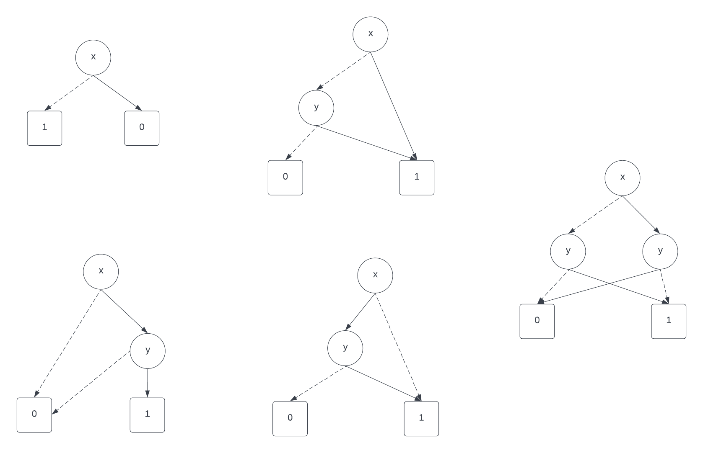

# Exercises Lecture 7

**Theme: Binary Decision Diagram (lecture 6)**
 
----

## Exercise 1

Needs to be solved

## Exercise 2

Tautology can be decided by using the algorithm to check if the two expressions ($b_1$ and $b_2$) are equivelant, as this means that they are true for all: 

Tautology = Equivalence($b_1, b_2$)

To see if the expression is satisfiable if they are not equivelant:

Satisfiability = ¬Equivalence($b_1, b_2$)

## Exercise 3

1. ¬x       ≡ x -> 0,1
2. x ^ y    ≡ x -> (y -> 1,0), 0
3. x V y    ≡ x -> 1, (y -> 1,0)
4. x => y   ≡ x -> (y -> 1,0), 1
5. x <=> y  ≡ x -> (y -> 1,0), (y -> 0,1)

## Exercise 4

t = ($x_1$ ^ $y_1$) V ($x_2$ ^ $y_2$)

t ≡ $x_1$ -> $t_1, t_0$ ≡ $x_1$ -> (1 ^ $y_1$) V ($x_2$ ^ $y_2$), (0 ^ $y_1$) V ($x_2$ ^ $y_2$)

$t_0$ ≡ $x_2$ -> $t_01, t_00$ ≡ $x_2$ -> (0 ^ $y_1$) V (1 ^ $y_2$), (0 ^ $y_1$) V (0 ^ $y_2$)
$t_1$ ≡ $x_2$ -> $t_11, t_10$ ≡ $x_2$ -> (1 ^ $y_1$) V (1 ^ $y_2$), (1 ^ $y_1$) V (0 ^ $y_2$)

$t_01$ ≡ $y_1$ -> $t_011, t_010$ ≡ $x_2$ -> (0 ^ 1) V (1 ^ $y_2$), (0 ^ 0) V (1 ^ $y_2$) ≡ 0 V (1 ^ $y_2$),  0 V (1 ^ $y_2$)
$t_00$ ≡ $y_1$ -> $t_001, t_000$ ≡ $x_2$ -> (0 ^ 1) V (0 ^ $y_2$), (0 ^ 0) V (0 ^ $y_2$) ≡ 0 V (0 ^ $y_2$),  0 V (0 ^ $y_2$)
$t_11$ ≡ $y_1$ -> $t_111, t_110$ ≡ $x_2$ -> (1 ^ 1) V (1 ^ $y_2$), (1 ^ 0) V (1 ^ $y_2$) ≡ 1 V (1 ^ $y_2$), 0 V (1 ^ $y_2$) ≡ 1, 0 V (1 ^ $y_2$)
$t_10$ ≡ $y_1$ -> $t_101, t_100$ ≡ $x_2$ -> (1 ^ 1) V (0 ^ $y_2$), (1 ^ 0) V (0 ^ $y_2$) ≡ 1 V (0 ^ $y_2$), 0 V (0 ^ $y_2$) ≡ 1, 0 V (0 ^ $y_2$)

$t_001$ ≡ $y_2$ -> $t_0011, t_0010$ ≡ $y_2$ -> 0 V (0 ^ 1), 0 V (0 ^ 0) ≡ 0, 0
$t_000$ ≡ $y_2$ -> $t_0001, t_0000$ ≡ $y_2$ -> 0 V (0 ^ 1), 0 V (0 ^ 0) ≡ 0, 0

$t_011$ ≡ $y_2$ -> $t_0111, t_0110$ ≡ $y_2$ -> 0 V (1 ^ 1), 0 V (1 ^ 0) ≡ 0 V 1, 0 V 0 ≡ 1, 0
$t_010$ ≡ $y_2$ -> $t_0101, t_0100$ ≡ $y_2$ -> 0 V (1 ^ 1), 0 V (1 ^ 0) ≡ 0 V 1, 0 V 0 ≡ 1, 0

-
$t_100$ ≡ $y_2$ -> $t_1001, t_1000$ ≡ $y_2$ -> 0 V (0 ^ 1), 0 V (0 ^ 1) ≡ 0 V 0, 0 V 0 ≡ 0, 0 

-
$t_110$ ≡ $y_2$ -> $t_1101, t_1100$ ≡ $y_2$ -> 0 V (1 ^ 1), 0 V (1 ^ 0) ≡ 1, 0