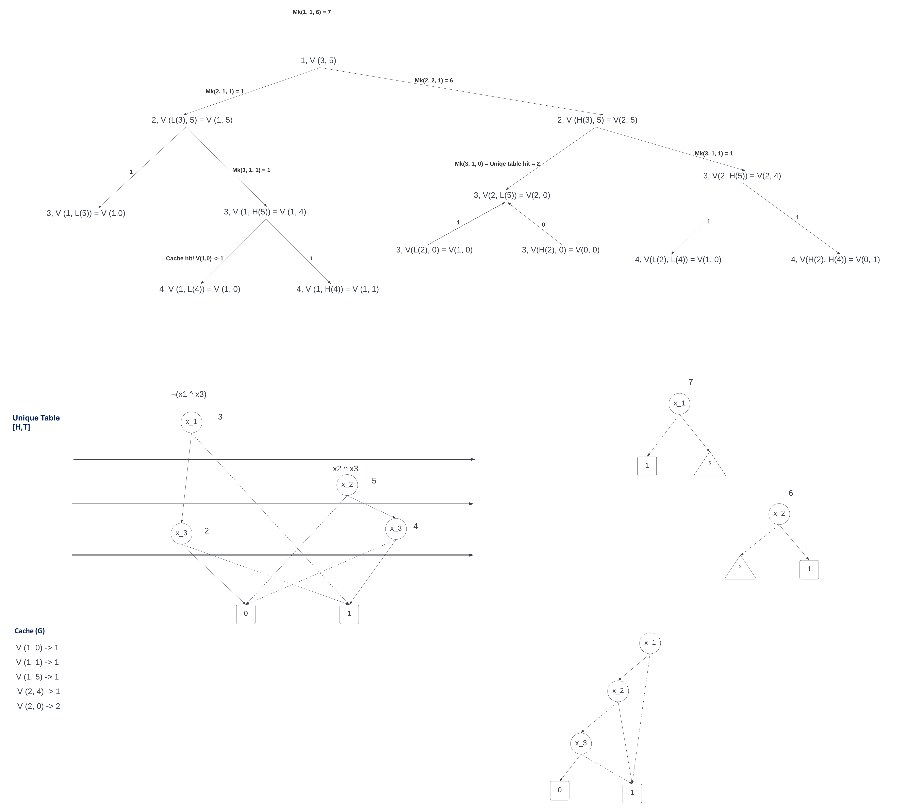

# Exercises Lecture 8

**Theme: Binary Decision Diagram II (lecture 7)**
 
----

## Exercise 1

| ID | Variable | Low | High |
|----|----------|-----|------|
| 0  | 4        | -   | -    |
| 1  | 4        | -   | -    |
| 2  | 3        | 0   | 1    |
| 3  | 3        | 1   | 0    |
| 4  | 2        | 2   | 3    |
| 5  | 1        | 4   | 0    |

## Exercise 2

See solution

## Exercise 3

| ID | Variable | Low | High |
|----|----------|-----|------|
| 0  | 3        | -   | -    |
| 1  | 3        | -   | -    |
| 2  | 1        | 0   | 1    |
| 3  | 2        | 0   | 0    |
| 4  | 1        | 1   | 3    |

Bit confusing, did exercise 4 instead

## Exercise 4

¬(x1 ^ x3) and x2 ^ x3

### ROBDD for build

| ID | Variable | Low | High |
|----|----------|-----|------|
| 0  | 4        | -   | -    |
| 1  | 4        | -   | -    |
| 2  | 3        | 1   | 0    |
| 3  | 1        | 1   | 2    |
| 4  | 3        | 0   | 1    |
| 5  | 2        | 0   | 4    |

### ROBDD for apply

