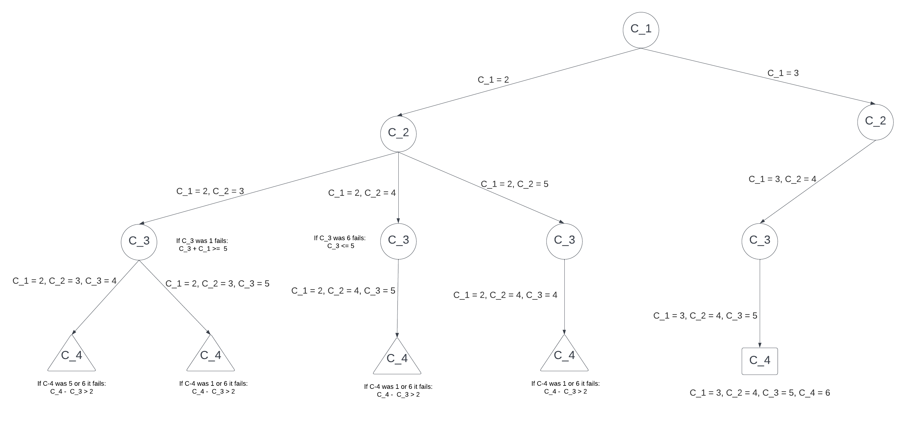
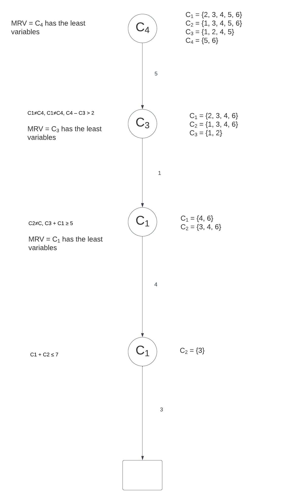
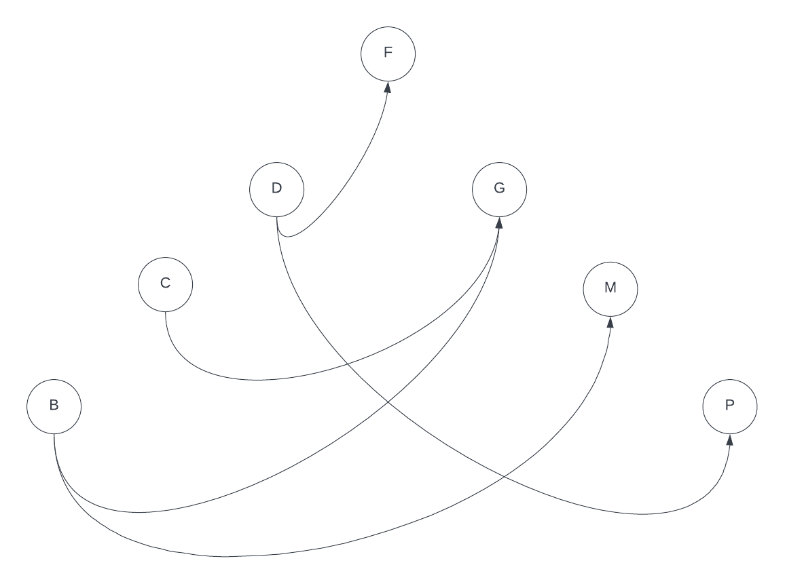
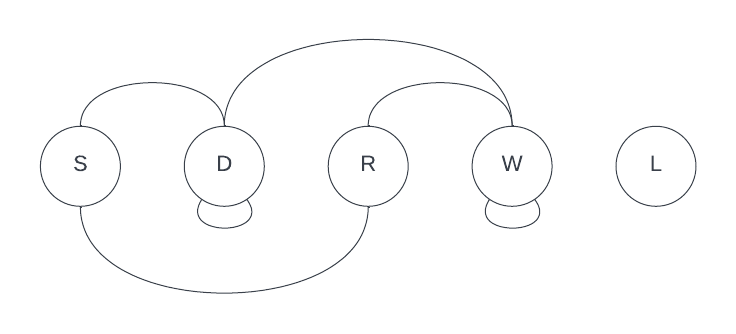
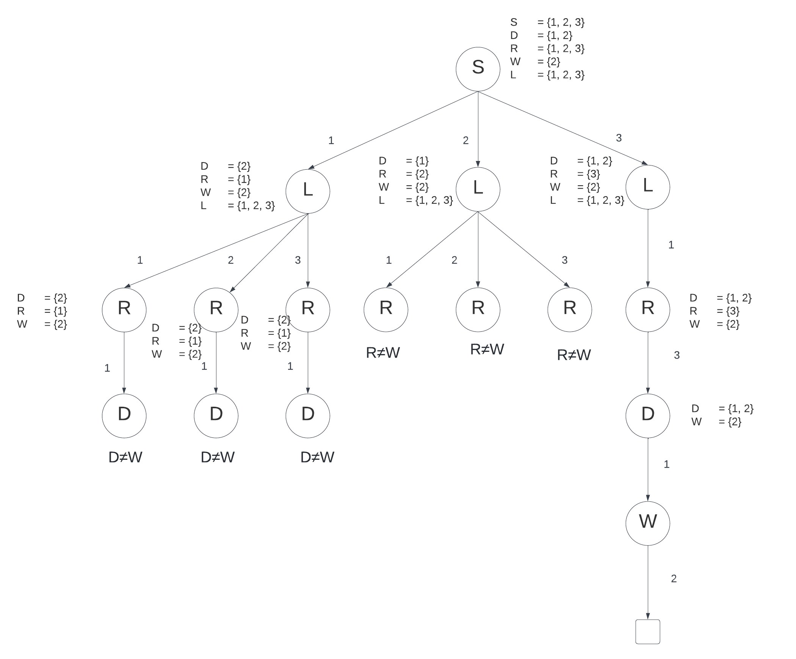
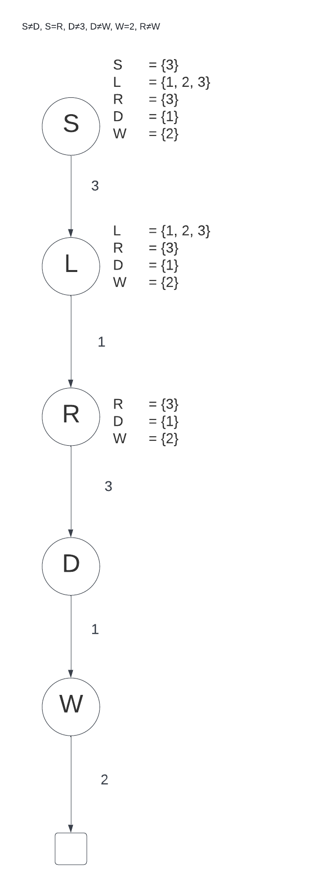

# Exercises Lecture 9

**Theme: Constraint Programming (lecture 8)**
 
----

## Exercise 1

### Task A

The solution is: 3, 4, 5, 6

### Task B

## Exercise 2

### Task A

adj(X, Y): x = y + 1 || x = y - 1

### Task B

### Task C

See solution

## Exercise 3

### Task A

Variables: {S, D, R, W, L}

Domains: {[1...3], [1...3], [1...3], [1...3], [1...3]}

Constraints: S≠D, S=R, D≠3, D≠W, W=2, R≠W

### Task B

### Task C

### Task D

