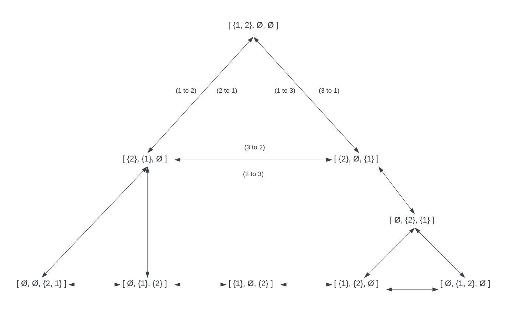

# Exercises Lecture 3

**Theme: Heuristic Search (lecture 2)**
 
----

## Exercise 1

### Task A

The initial state: s0 = {1, ..., n}, where the smallest disk is 1 and the largest is n, and the disks in between are in chronological order.

Actions = {(1 to 2), (1 to 3), (2 to 1),(2 to 3), (3 to 2), (3 to 1)}

See the solution for explaination

### Task B

### Task C
3n

See the solution for explaination

## Exercise 2

### Task A

| Iteration | Frontier                                                  |
|-----------|-----------------------------------------------------------|
| 0         | <244, 0, 244, L>                                          |
| 1         | <311, 70, 241, M> <440, 111, 329, T>                      |
| 2         | <386, 145, 241, D> <440, 111, 329, T>                     |
| 3         | <425, 265, 160, C> <440, 111, 329, T>                     |
| 4         | <606, 413, 143, RV> <503, 403, 100, P> <440, 111, 329, T> |
| 5         | <606, 413, 143, RV> <503, 403, 100, P> <565, 229, 336, A> |
| 6         | <606, 413, 143, RV> <504, 504, 0, B> <565, 229, 336, A>   |

### Task B 

A* returns an expanded goal node, which is:
<504, 504, 0, B>

### Task C

L -> M -> D -> C -> P -> B

## Exercise 3

### Task A 

