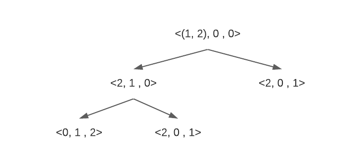

# Answers lecture 3

## Exercise 1

### Task 1A

**The initial state:** \
All of the n disks are placed on the left-most peg, stacked in order of size where the smallest is at the top.\
$s_0 = $ <n, 0, 0>

**The actions function:** \
The actions function always have two differnt types, left and right, however these might be constrained, and could be done two times \
{left, right}

**The result function:** (transition model). \
Defined by the rules: \
1: Left and right, and double as well: appplicable if there is some peg there, and the disks already placed on this peg is greater of size than the one to be placed.

**The is-goal function:** \
s = <0, 0, n>

**The action cost function:** \
1 for all actions

### Task 1B

### Task 1C
$f(n) = (n * 3)^3$

## Exercise 2

### Task 2A

