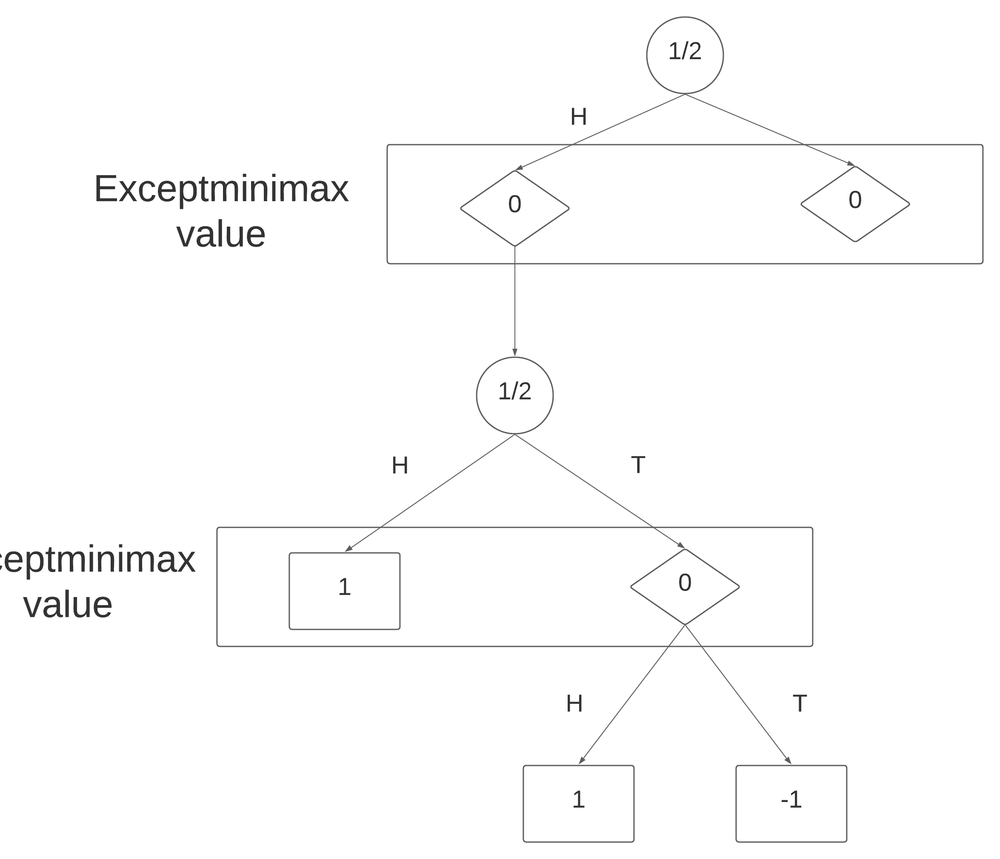

# Mandatory Assignment 2

**Name:** Bjørnar Haugstad Jåtten \
**ITU-username:** bjja@itu.dk

------------------

## Task 1

The major difference between minimax and expectiminimax is the difference in how the reward is calculated:

    function EXPECTMINIMAX-SEARCH(game,state) returns an action
        value, move ← MAX-VALUE(game,state)
    return move

    function MAX-VALUE(game,state) returns (utility,move)
        if game.IS-TERMINAL(state) then
            return game.UTILITY(state,MAX), null
        v ← -∞
        for each a in game.ACTIONS(state) do
            v2,a2 ← MIN-VALUE(game, CHANCE-VALUE(false, game.RESULT(state,a)))
            if v2 > v then
        v,move ← v2,a
    return v,move

    function MIN-VALUE(game,state) returns (utility,move)
        if game.IS-TERMINAL(state) then
            return game.UTILITY(state,MAX), null
        v ← +∞
        for each a in game.ACTIONS(state) do
            v2,a2 ← MAX-VALUE(game, CHANCE-VALUE(true, game.RESULT(state,a)))
            if v2 < v then
                v,move ← v2,a
    return v,move

    function CHANCE-VALUE(isMinVal, result) returns ExpectedReward
        if isMinVal then
            // To show 50% probability, we randomize either 0 or 1, and depending on the result, we update the game
            probability = RANDOM(0, 1)
            if(probability = 0) then
                result.RESULT(-1, result.RESULT.action)
            else then
                result.RESULT(0, result.RESULT.action)
        else isMinVal then
            probability = RANDOM(0, 1)
            if(probability = 0) then
                result.RESULT(0, result.RESULT.action)
            else then
                result.RESULT(-1, result.RESULT.action)

## Task 2

### Task 2A and task 2B

### Task 2C

The exceptminimax would be head head and then win.
