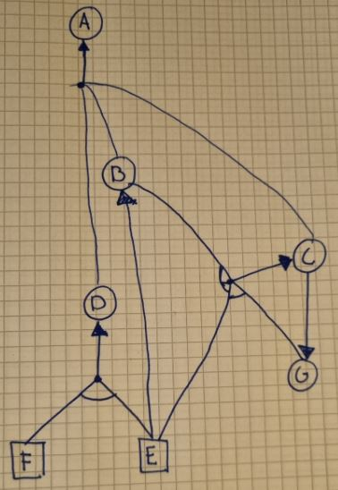

# Mandatory Assignment 3

**Name:** Bjørnar Haugstad Jåtten \
**ITU-username:** bjja@itu.dk

------------------

## Task 1

The main difference between forward- and backward-chaining is that forward-chaining works from the initial state and tries to find the final state. Backward-chaining on the other hand, starts from the final state and goes back to the initial state. Backward-chaining is therefore useful for cases where we already known the outcome, but need to find out how this outcome came to be.

In the book, they come up with example questions like "what shall I do now?" and "where are my keys?". Here we both know the goal states (we know that the keys are somewhere), but we do not know how the goal state came to be (we do not know how the keys ended up somewhere). This type of reasoning is called **goal direct reasoning**, whereas forward-chaining is data-driven instead of goal-driven.

## Task 2

Given the definite clauses, I was able to construct this tree:

By looking at the definitie caluses, we know that F and E is true.

To see if we can query A for KB, we first have to prove that D, B and C is true. We can prove D, as it is implied by F and E, which is a known facts. We can also prove that B is true, as it is implied by E, which is a known fact. To prove C, it needs to be implied B, E and G. Altough we already have proven B and E, we cannot prove G, as it needs to be implied by C, making it a endless loop. Professor Smart's algorithm can therefore not answer a query A for KB.

### Task 2 pseudo-code

The reason why we can't prove G, and go into an endless loop is because there is not implemented any way to check if we already have checked the queried symbol. By implementing an function like IS-CYCLE(), as they do in figure 4.11 in the book, which checks if the current query is a cycle, we can avoid this.

In the implementation below, I have added this IS-CYCLE() function.

    function PL-BC-ENTAILS(KB, q) returns true or false
        inputs: KB, the knowledge base, a set of propositional definite clauses 
                q, the query, a propositional symbol
        if q is known to be true in KB then return true
        if IS-CYCLE(q) then return false
        for each clause c in KB where q is in c.CONCLUSION do
                if CHECK-ALL(KB, c.PREMISE) then return true
        return false

    function CHECK-ALL(KB, premise) returns true or false
        inputs: KB, the knowledge base, a set of propositional definite clauses 
                premise, a set of propositional symbols
        for each p in premise do
            if not PL-BC-Entails(KB, p) then return false
        return true

## TASK 3

With my extensions to Smart's algortihm, I would argue that the algorithm runs in linear time. As we have avoided the issues of loops, a well functioning backward-chaining algorithm should be able to run in linear, or less than linear time. This is because we already know the goal, and do not have to go trough as many clauses, as we for example would have for forward-chaining. When knowing the goal, we can just search for the goal, but when running forward, we will explore all of the known clauses.
