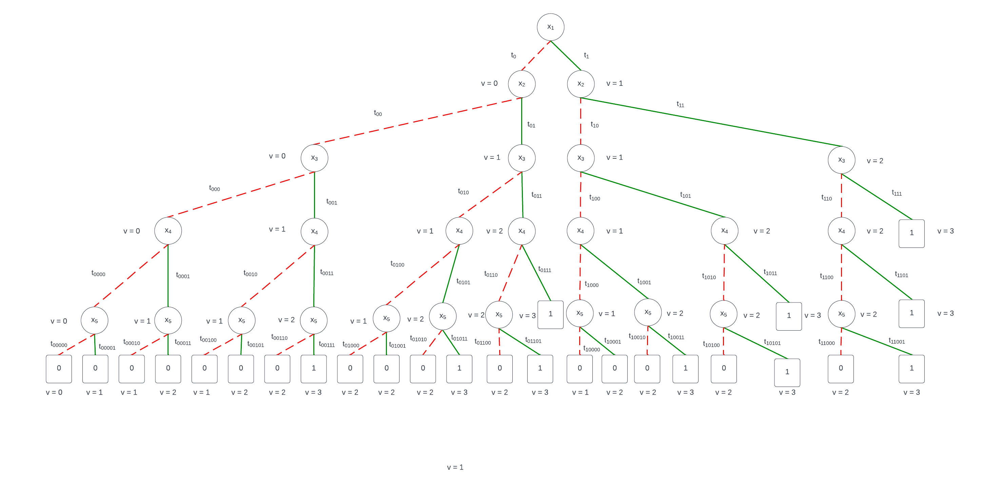
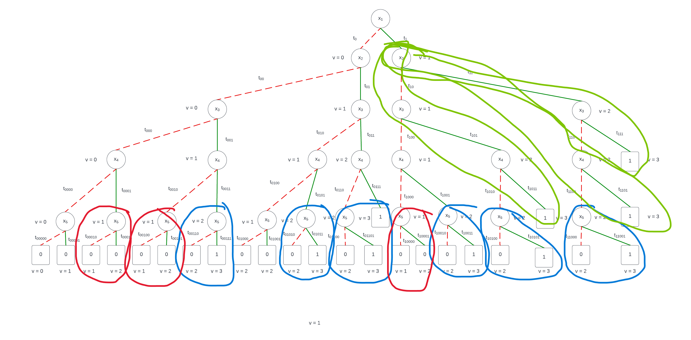
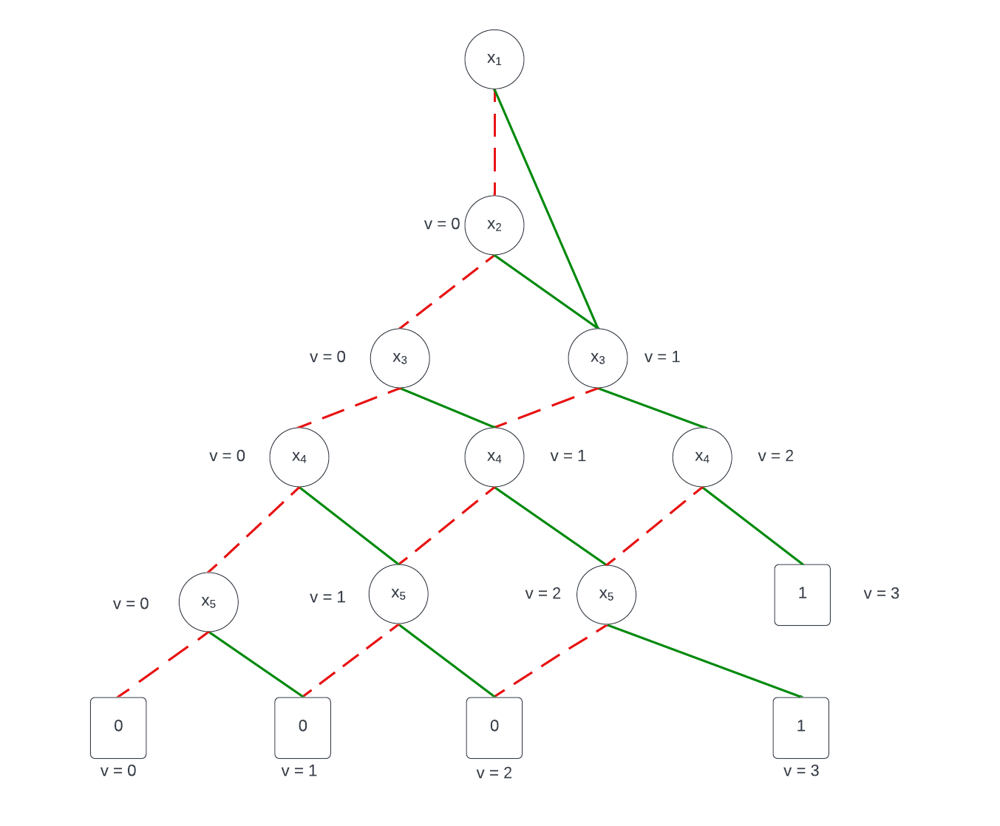

# Mandatory Assignment 5

**Name:** Bjørnar Haugstad Jåtten \
**ITU-username:** bjja@itu.dk

------------------

## Task 1 and 2

I start off by creating the decision tree, including all possible states individually, indluding their value v, which is the current true's:

As we can see, this tree is not an Reduced Ordered Binary Decision Diagram (ROBDD). Although ordered it is not yet reduced. By implementing the uniqeness requirement, as well as removing redundant tests, we are left with a ROBDD.

Examples of uniqeness (similar color indicates same test):

When removing some of these, we are left with redundant tests, or in other words, tests where either 0 or 1 leave us with the same result.

After both moving redundant, and non-unique test, I was left with this tree, with the values v:

## Task 3

As we can see from my ROBDD, the size is actually O(kn) = O(3*5) = O(15). The size of the ROBDDs are heavily depending on the variable ordering. This is because that the size of ROBDDS are exponential, and this is also the case of our graph. This is because we have to calculate the whole depth before we know the result.

The size of the tree is also dependent on how many possible end values there are, which is always k+1. After a certain point, this is also the maximum number of new nodes that are added, as you can see from below x4.
